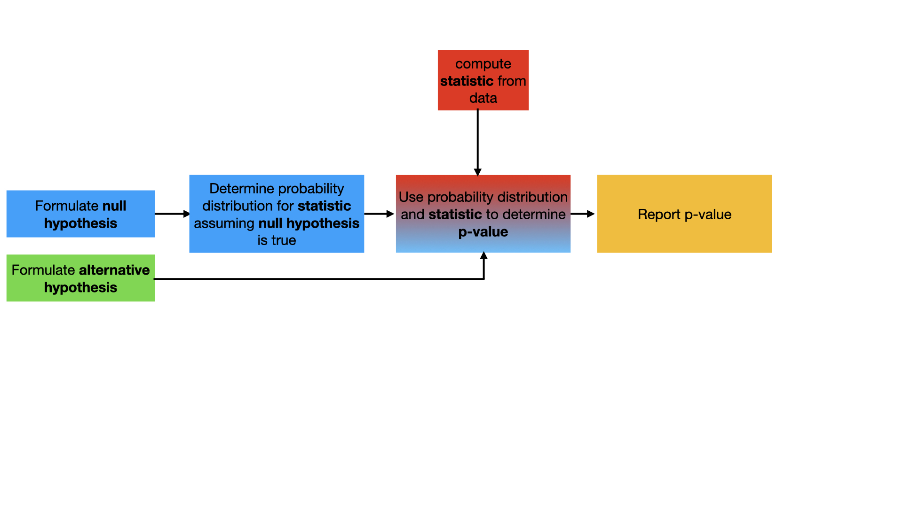

# The p-value

Hopefully, now that you have completed one of these exercises it is clearer how the __p-value__ is computed.  As discussed in the previous exercise, the __p-value__ is the maximum probability that the __null hypothesis__ and not the __alternative hypothesis__ is true given the value of the __statistic__.  Now that you have computed a __p-value__, this definition is hopefully a little clearer.  

In this exercise, we are going to consider how we use the new hypothesis-test workflow that is illustrated in the flowchart as well as the ideas on the test statistic that we encountered in the last but one task.

I have provided you with some data in the file `mydata.dat` that may or not be a series of samples from a normal distribution with expectation 3 and standard deviation 4.   You should perform a hypothesis test with the following null and hypothesis tests:

1. __null hypothesis__: The distribution that was sampled has an expectation of 3
2. __alternative hypothesis__: The distribution that was sampled has an expectation that is greater than 3

To get you started I have written some functions that you will need to complete:

1. `testStatistic` - Three variables are passed to this function.  `data` is a NumPy array that contains N normal random variables, `mu` is the value of the expectation for the distribution that is assumed under the null hypothesis and `sigma` is the square root of the variance for the distribution.  This function should calculate and return the test statistic:

)

2. `pvalue` - Three variables are passed to this function.  `data` is a NumPy array that contains N normal random variables, `mu` is the value of the expectation for the distribution that is assumed under the null hypothesis and `sigma` is the square root of the variance for the distribution.  The function calls `testStatistic` to evaluate T using the formula above.  You should modify it so that the function returns the p-value based on the value of the __statistic__.
